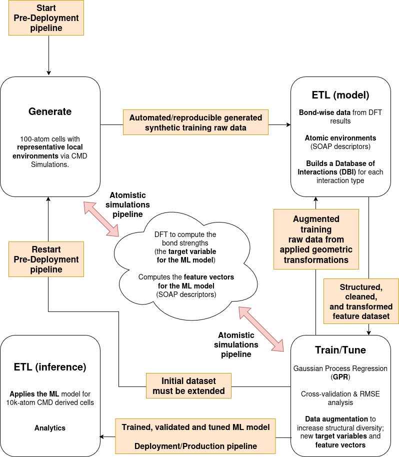
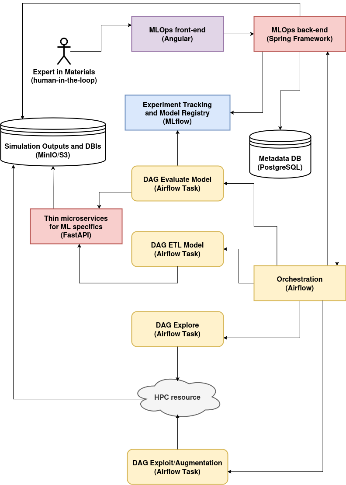

# PRM_4_113603_MLOps_Java

The repository [PRM_4_113603_MLOps](https://github.com/aryrfjr/PRM_4_113603_MLOps) contains an ongoing **Python-based** implementation of the **MLOps system** for predicting DFT-level chemical bond strengths (-ICOHP values) in metallic glasses based on the methodology published in Phys. Rev. Materials 4, 113603 (DOI: https://doi.org/10.1103/PhysRevMaterials.4.113603; or the [preprint](https://www.researchgate.net/publication/345634787_Chemical_bonding_in_metallic_glasses_from_machine_learning_and_crystal_orbital_Hamilton_population)). It follows a **GETL (Generate + ETL)** approach combining classical molecular dynamics, DFT simulations, and machine learning (Gaussian Process Regression) with SOAP descriptors and bond distances as features, whose original workflow is available in the repository [PRM_4_113603](https://github.com/aryrfjr/PRM_4_113603). Below is a high-level diagram describing the original pipeline that I developed between 2018 and 2019 in my last post-doc experience:

The repository repository [PRM_4_113603_MLOps](https://github.com/aryrfjr/PRM_4_113603_MLOps) includes **data generation**, **feature engineering**, **model training**, **evaluation**, and **human-in-the-loop active learning**, all planned to be orchestrated through **Airflow**, tracked via **MLflow**, and stored in PostgreSQL and MinIO/S3-based stores. The architecture consists of a set of services (**Streamlit**, **FastAPI**, **Airflow**, and **MLflow**) which coordinate the execution of key components such as the **data explorer and augmenter**, the **human-in-the-loop active learning** process, and **feature extraction** pipeline.

The **FastAPI back-end application** serves as the central controller in this architecture, acting as the communication bridge between the **Streamlit** user interface and the services for **workflow orchestration** and **ML lifecycle** management. It handles all user-triggered actions such as launching **data generation**, triggering **model evaluations**, and updating **experiment states**. By exposing a clean REST interface, it enables modular coordination of the MLOps components, facilitating **interactive workflows**, **experiment reproducibility**, and seamless **integration** with other services like **Airflow** and the **Feature Store Lite**.

For building reliable, scalable, and maintainable systems, Java with **Spring Boot** is clearly superior to Python-based frameworks like **FastAPI** (and generally superior to other alternatives like **Flask** or **Django**). It offers a mature, **enterprise-grade platform** with powerful built-in features for **security**, **configuration**, **monitoring**, **scalability**, **maintainability**, and **integration** with additional services like **Kafka**, **Redis**. Additionally, it and simplifies integration with corporate systems such as **SSO (Single Sign-On)**, **LDAP**, **OAuth2** providers, centralized logging and data governance tools; all of which are essential in enterprise environments. By leveraging **Spring Boot**, the **MLOps platform** becomes easier to deploy, audit, secure, and scale across teams, making it a stronger fit for long-term use within an organization.

This repository provides a **Java-based** counterpart for the controller layer that handles all user-triggered interactions (via an **Angular** app) and serves as the central gateway. Built with **Spring Boot**, it exposes orchestration endpoints callable by **Airflow** while delegating domain-specific tasks like **model training** to Python-based services implemented with **FastAPI**, following a **microservice-friendly**, polyglot architecture, described in the following diagram:

- 📝 **NOTE**: REST API documentation: http://localhost:8080/swagger-ui.html
  
- 📝 **NOTE**: MinIO console UI: http://localhost:9001

- 📝 **NOTE**: Angular (DEV): http://localhost:4200
