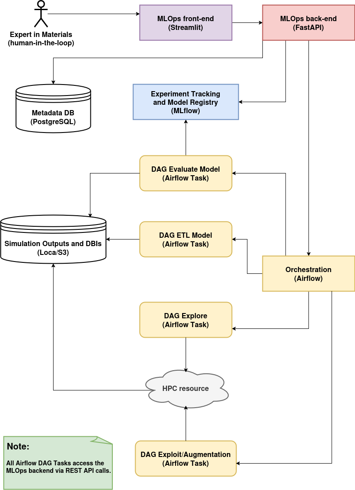

# PRM_4_113603_MLOps_Java

The repository [PRM_4_113603_MLOps](https://github.com/aryrfjr/PRM_4_113603_MLOps) implements a **Python-based MLOps workflow** for predicting DFT-level chemical bond strengths (-ICOHP values) in metallic glasses, based on the methodology published in Phys. Rev. Materials 4, 113603 (DOI: https://doi.org/10.1103/PhysRevMaterials.4.113603; or the [preprint](https://www.researchgate.net/publication/345634787_Chemical_bonding_in_metallic_glasses_from_machine_learning_and_crystal_orbital_Hamilton_population)). It follows a **GETL (Generate + ETL)** approach combining classical molecular dynamics, DFT simulations, and machine learning (Gaussian Process Regression) with SOAP descriptors and bond distances as features.

The pipeline includes **data generation**, **feature engineering**, **model training**, **evaluation**, and **human-in-the-loop active learning**, all orchestrated through **Airflow**, tracked via **MLflow**, and stored in PostgreSQL and local (could be S3-based) stores.

The architecture consists of a set of services (**Streamlit**, **FastAPI**, **Airflow**, and **MLflow**) which coordinate the execution of key components such as the **data explorer and augmenter**, the **human-in-the-loop active learning** process, and **feature extraction** pipeline.

The **FastAPI application** serves as the central controller in this architecture, acting as the communication bridge between the **Streamlit** user interface and the backend services. It handles all user-triggered actions such as launching **data generation**, triggering **model evaluations**, and updating **experiment states**. By exposing a clean REST interface, it enables modular coordination of the MLOps components, facilitating interactive workflows, experiment reproducibility, and seamless integration with other services like **Airflow** and the **Feature Store Lite**.

This repository contains a Java counterpart for the controller layer that handles all user-triggered interactions (via Streamlit) and acts as the central gateway, which was implemented with Python and FastAPI in the repository [PRM_4_113603_MLOps](https://github.com/aryrfjr/PRM_4_113603_MLOps).

REST API documentation: http://localhost:8080/swagger-ui.html
